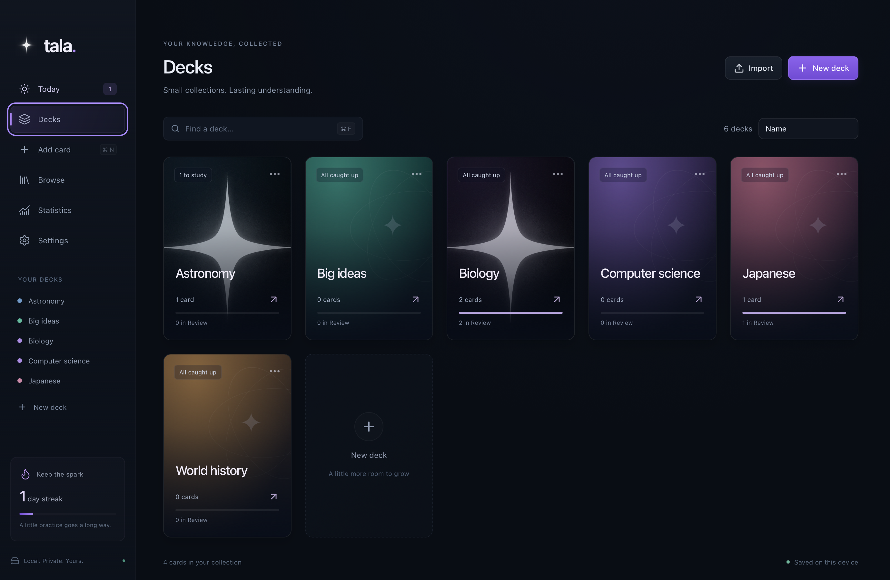
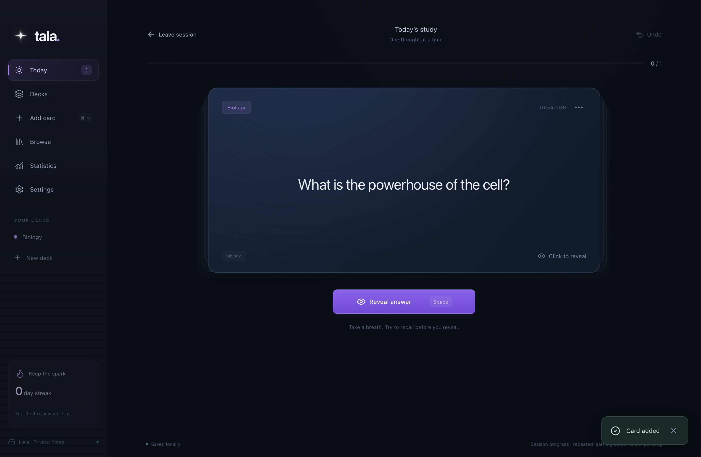
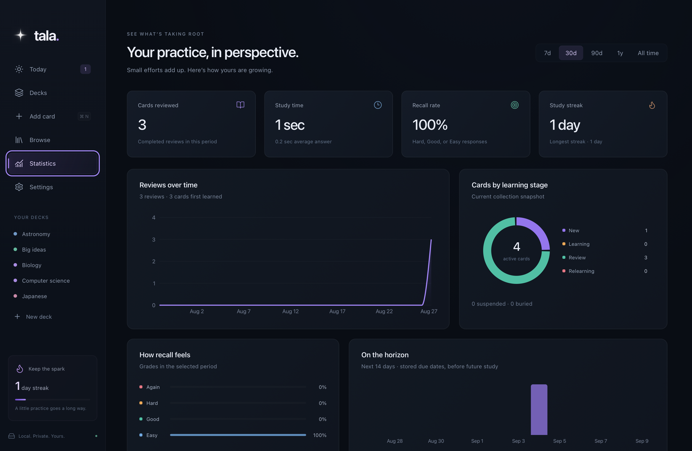

# Tala

**Your space to remember.** Tala is a local-first desktop flashcard application for deliberate, repeatable study. Write rich cards, organize them into decks, and let spaced repetition bring them back when they need attention. Your collection stays on your Mac, with no account, subscription, or server required.

**Current version: v1.0.0** · Apple Silicon · macOS 14 or later

The interface centers on a four-point star and a simple idea: a little practice goes a long way. Tala starts with an empty collection; it does not ship personal data or sample decks.

## Screenshots

These native app captures use disposable test collections, not personal study data.



| Study                                                 | Statistics                                                             |
| ----------------------------------------------------- | ---------------------------------------------------------------------- |
|  |  |

## Features

- **Rich flashcards:** Normal, Reversed, and Type in the Answer behaviors, with bold/italic/underline, lists, headings, code, links, colors, subscript/superscript, and inline or display mathematics.
- **Local images:** Attach PNG, JPEG, WebP, and GIF images from disk or paste an image from the clipboard. Images are copied into the collection; their original location is not needed afterward. Individual images are limited to 20 MB and 40 million pixels.
- **Decks and tags:** Flat decks with optional cover artwork, per-deck scheduling, normalized tags, search, sorting, and bulk organization.
- **Spaced repetition:** FSRS 6 memory scheduling, configurable learning/relearning steps, desired retention, daily new/review limits, ordering, maximum intervals, and leech handling.
- **Focused study:** Reveal before grading with Again, Hard, Good, or Easy; keyboard controls, typed-answer comparison, session progress, and waiting states for later learning repetitions. Typed comparisons never choose your grade for you.
- **Collection management:** Searchable card browser, review history, manual due dates, reset/reschedule, suspension, burying until tomorrow, undo, and Recently Deleted.
- **Study history:** Review counts, recall rate, study time, streaks, learning stages, deck progress, and a 14-day due forecast.
- **Transfers and recovery:** CSV/TSV import with mapping, preview, and duplicate policies; plain-text export; complete `.tala` archives; automatic/manual backups; integrity checks; and repair of derived indexes.
- **Desktop conveniences:** Remembered window geometry, interface scaling, dark appearance, reduced-motion support, and confirmation before abandoning unsaved card edits.

Each Basic note produces one card. Changing its text, behavior, tags, or deck preserves that card's scheduling and review history.

## Get started

### Install a packaged build

The supported release target is an **Apple Silicon Mac running macOS 14+**. When a maintainer publishes a DMG, open it and drag **Tala.app** into **Applications**. No public download is assumed to exist yet; you can also build the app from this repository.

The current packaging configuration uses an **ad-hoc signature**. It does not provide Apple Developer ID signing or notarization, so macOS may block a downloaded copy. Only approve software whose source you trust; do not disable system security globally. Intel, Windows, and Linux packages have not been validated.

### Your first session

1. Create a deck from **Decks** or **New deck** in the sidebar.
2. Choose **Add card**, write the Front and Back, and save.
3. Open **Today**, start studying, reveal the answer, and choose a grade.
4. Use **Browse** to edit or organize cards and **Statistics** to review your practice.

During study, **Space** reveals an answer and **1–4** grade it after reveal. **⌘N** adds a card, **⌘S** saves in the editor, and **⌘Z** undoes the last eligible collection action when focus is outside a text field. Text editors retain their own undo history.

## Local storage and privacy

Tala stores rich content as validated **TipTap JSON in SQLite**, alongside schedules, preferences, tags, and review history. It does **not** store Markdown journal files. Images and deck artwork are separate content-addressed files.

The normal data root on macOS is:

```text
~/Library/Application Support/app.tala.desktop/
├── collection/
│   ├── tala.sqlite3
│   └── media/
├── backups/
└── logs/
```

**Settings → Data & backups** shows the exact path and opens the folder in Finder. SQLite may create `-wal` and `-shm` companions while the app is running. Do not delete these or edit/replace the database while Tala is open. Use the built-in export/restore controls for transfers.

- Authoring, search, study, images, mathematics, statistics, import/export, and backups work offline. Fonts and rendering code are bundled; the installed app needs no development server.
- There are no accounts, cloud synchronization, analytics, or automatic uploads. No API keys or environment file are required for normal use or development.
- User-activated web/email links open in your default external application. Those destinations may need internet access and have their own privacy practices. Remote images, videos, and YouTube embeds are not supported.
- The **Saved locally / Saved on this device** label describes local persistence. It is not a connectivity or cloud-sync indicator.
- Collections and backups are **not encrypted by Tala**. Protect your device and any exported copies using your operating system's security and storage controls.
- Local logs record operational errors, not deliberately logged card bodies. Diagnostic exports can contain internal IDs and media filenames; review them before sharing. Never attach your collection or backups to a public issue unless you intend to disclose their contents.

## Backups and transfers

Use a **`.tala` export** for complete recovery: it includes the database, media, artwork, preferences, schedules, and review history. Archives are versioned ZIP files with checksums; restore validates their structure and contents before replacement and creates a safety backup.

Automatic backups are enabled by default. Tala checks every 30 seconds and creates at most one automatic backup per local day after collection changes. The default retention is ten automatic copies; manual and pre-restore copies are retained separately. This is not a backup after every edit. Copies on the same disk do not protect against disk loss—keep a recent export elsewhere when needed.

If the collection cannot open, startup recovery can restore a selected archive while preserving the original database, WAL, and media under `recovery-preserved/`. Keep those files until recovery has been confirmed.

**CSV/TSV** is for plain-text exchange. Export includes Front, Back, Behavior, Deck, and semicolon-separated Tags, but not rich formatting, image bytes, schedules, or history. Import explicitly selects a target deck and behavior; it does not automatically reconstruct every exported deck/behavior. Duplicates match normalized Front + selected behavior + target deck and can be skipped, updated, or imported separately. Updates preserve existing scheduling.

Spreadsheet applications may interpret text beginning with formula characters. Import such CSV/TSV columns as text; Tala preserves the original text rather than rewriting it.

## Development

The validated development environment is Apple Silicon macOS 14+, Xcode Command Line Tools, **Node.js 24**, **pnpm 11** (the exact package-manager version is in `package.json`), and **Rust/Cargo 1.98**. Install these tools before running the following commands from a checkout. Initial dependency installation requires internet access.

```sh
pnpm install --frozen-lockfile
pnpm tauri dev
```

`pnpm dev` starts only Vite on `127.0.0.1:1420`. Collection operations require the native Tauri app; there is no simulated browser backend. A normal development build uses the normal Tala data directory, so back up a real collection before testing changes. Automated tests use isolated temporary collections.

### Stack and layout

| Area                       | Technology / location                                                             |
| -------------------------- | --------------------------------------------------------------------------------- |
| Native shell and commands  | Tauri 2 and Rust, `src-tauri/src/`                                                |
| Persistence                | SQLite with WAL, foreign keys, FTS5, and versioned migrations                     |
| Scheduler                  | FSRS 6, pinned `fsrs` crate                                                       |
| Interface                  | React 19, TypeScript, Vite, Radix UI, TanStack Query/Table/Virtual                |
| Rich content and equations | TipTap and bundled KaTeX                                                          |
| Charts                     | Recharts                                                                          |
| Contracts                  | Rust models → ts-rs → `src/bindings/`                                             |
| Tests                      | Vitest/Testing Library, Rust unit/integration tests, native WebdriverIO workflows |

See [architecture and behavior](docs/ARCHITECTURE.md) for storage invariants, scheduling semantics, trust boundaries, and a source map.

### Validate

```sh
pnpm format:check
pnpm lint
pnpm check
pnpm test
pnpm test:rust
pnpm build
```

`pnpm format` applies Prettier and rustfmt. Linting uses TypeScript's strict/unused-code checks and Clippy with warnings denied. Native UI tests, offline verification, generated contracts, and the optional large-collection benchmark are documented in [Testing](docs/TESTING.md).

### Build a macOS package

```sh
pnpm tauri build
```

For v1.0.0 on Apple Silicon, this produces:

```text
src-tauri/target/release/bundle/macos/Tala.app
src-tauri/target/release/bundle/dmg/Tala_1.0.0_aarch64.dmg
```

Do not enable the Cargo `e2e` feature or set `VITE_TALA_E2E=1` for a distributable build. See [Release preparation](docs/RELEASING.md) for versioning, package verification, and the final publication checks.

## Current limitations

- One local collection and flat decks; no account, sync, multiple profiles, mobile app, or automatic updater.
- No Cloze cards, image occlusion, audio, plugins, Anki package support, or FSRS parameter optimization.
- Dark appearance only. Keyboard shortcuts and packaging are designed and validated for macOS.
- Search uses token/prefix matching, not Anki's query language. Rich editing uses toolbar controls, not slash commands.
- The study forecast shows stored due dates before future grades or daily limits; it is not a guaranteed workload. Recall reflects your chosen grades.
- No journal calendar, scheduled notifications, or journaling reminders. Learning cards resume while the app is open; Tala does not send background reminders.
- Unsaved editor buffers cannot survive force termination or power loss. Saved changes commit immediately to SQLite.

## Contributing

Bug reports, documentation corrections, and focused changes are welcome. Start with [CONTRIBUTING.md](CONTRIBUTING.md), include reproduction steps and the checks you ran, and use synthetic examples instead of personal collections. Discuss substantial features before implementation.

## License

No project license has been established in this repository. Public availability alone does not grant a general license to reuse or redistribute Tala; the maintainer must choose terms before representing it as open source.

Dependencies have their own licenses. [THIRD-PARTY-NOTICES.txt](THIRD-PARTY-NOTICES.txt) contains their notices and is included in the app bundle. Regenerate it after dependency changes with `node scripts/notices.mjs`; it is not a license for Tala itself.
